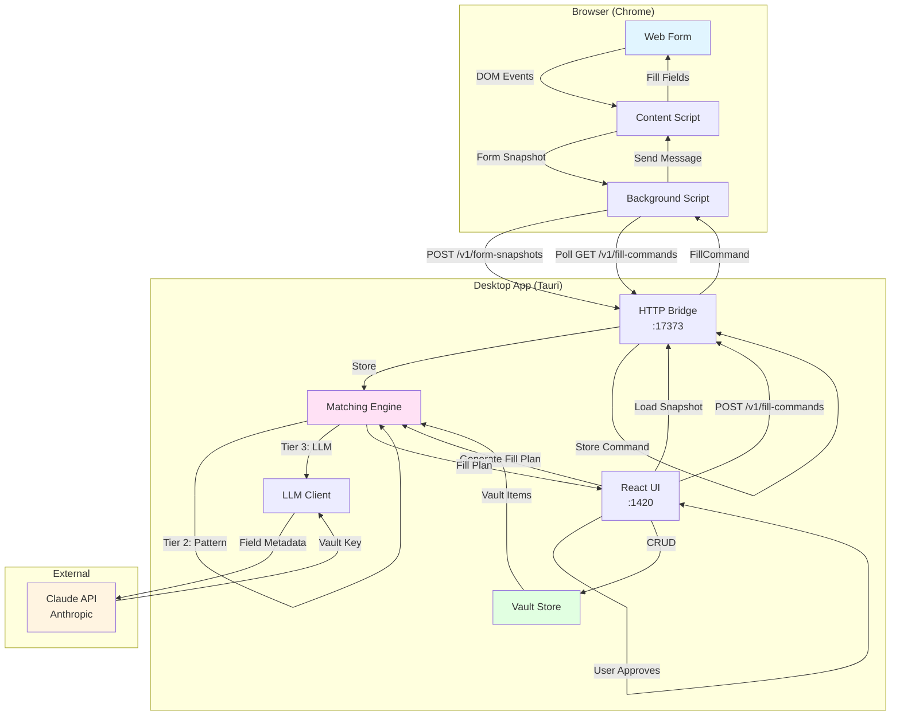
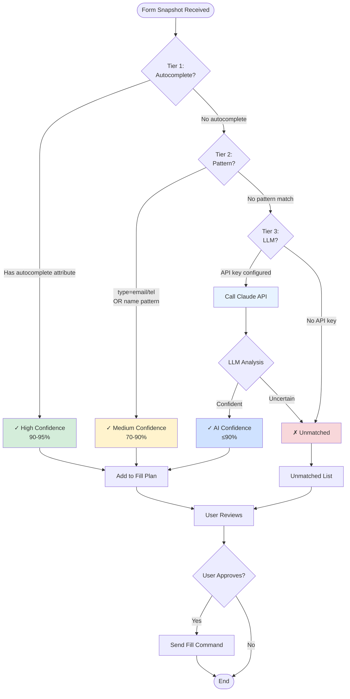
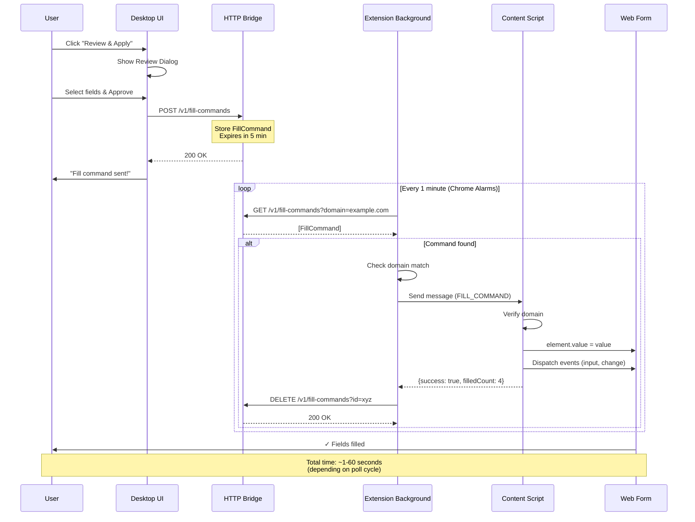
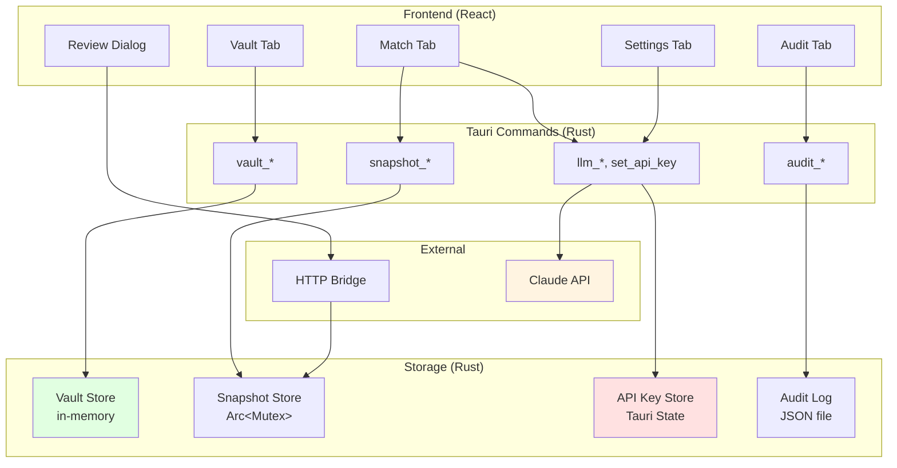
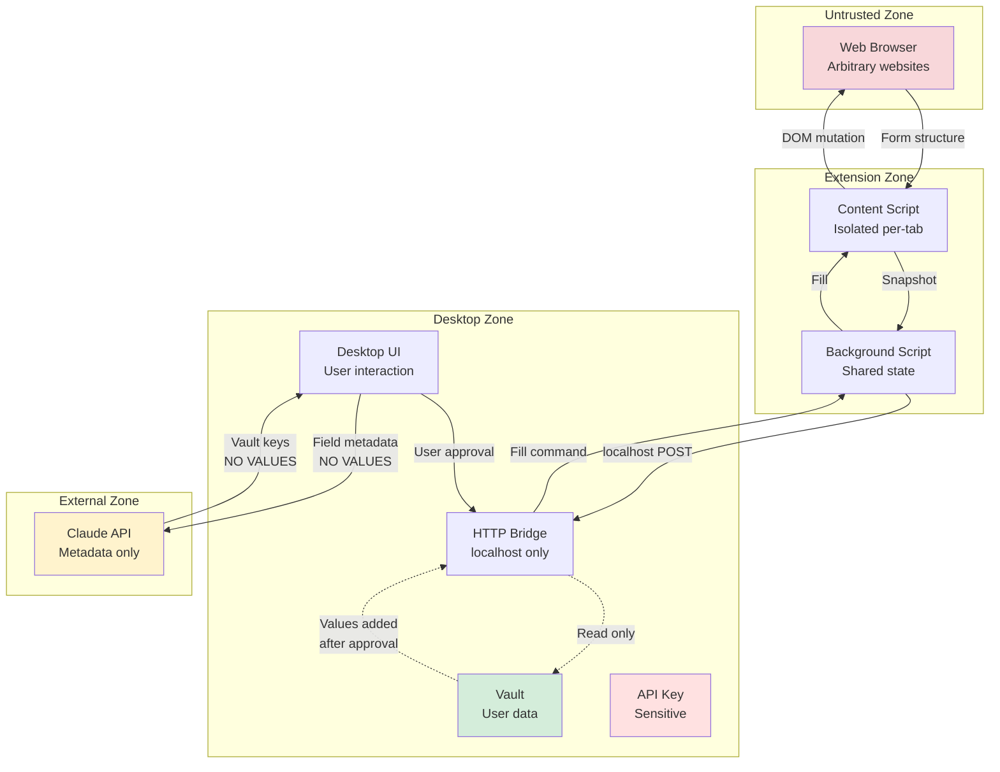
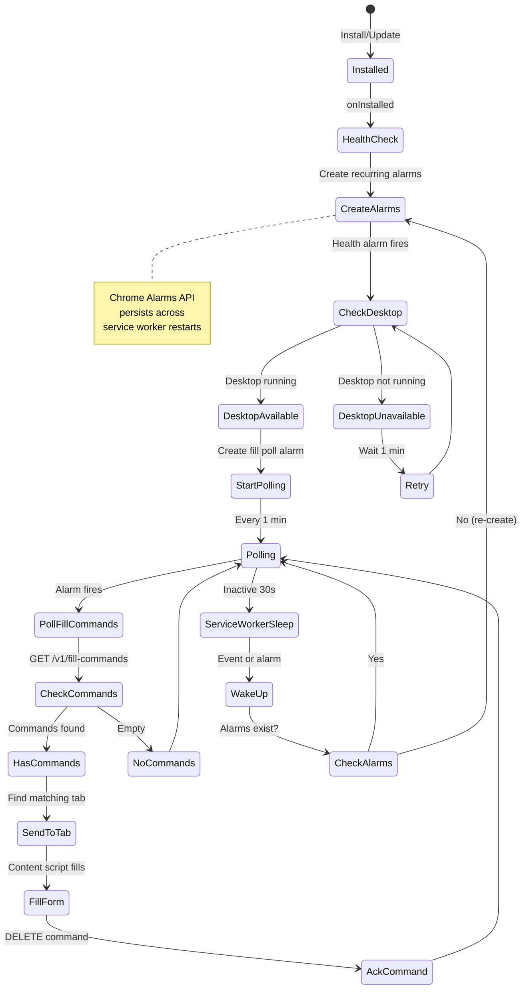
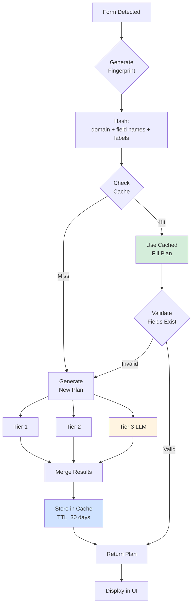
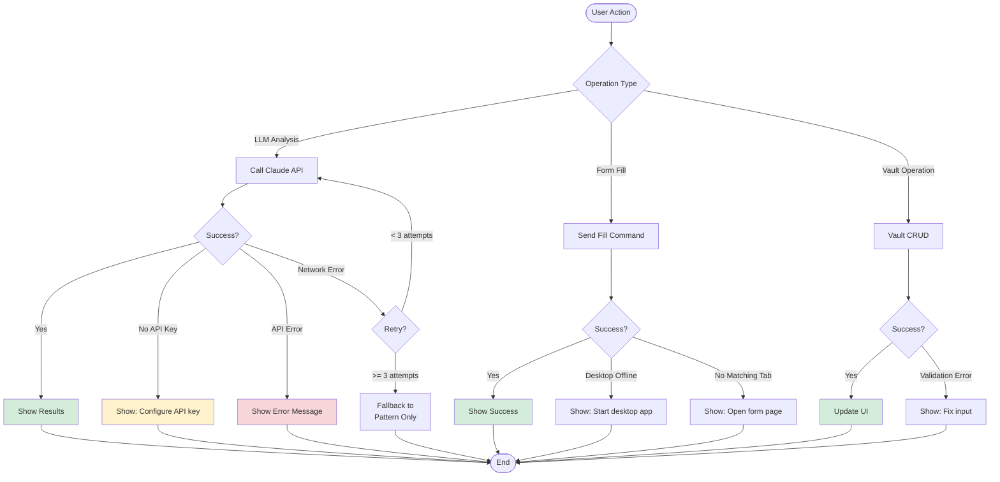

# Architecture Diagrams

Visual representation of Asterisk's system architecture, data flows, and interaction patterns.

## System Overview

---

## Matching Engine Flow

---

## Form Injection Sequence

---

## Data Flow: Form Detection → Fill

```mermaid
flowchart LR
    subgraph Browser
        A[User visits form] --> B[DOM loaded]
        B --> C[Content Script<br/>observes forms]
        C --> D[Extract FormSnapshot]
        D --> E[Background sends<br/>to desktop]
    end

    subgraph Desktop
        E --> F[HTTP Bridge<br/>stores snapshot]
        F --> G[User opens<br/>Match tab]
        G --> H[Load snapshot<br/>from storage]
        H --> I[Generate Fill Plan]

        I --> J[Tier 1: Autocomplete]
        I --> K[Tier 2: Pattern]
        I --> L[Tier 3: LLM]

        J --> M[Merge results]
        K --> M
        L --> M

        M --> N[Display in UI]
        N --> O[User reviews]
        O --> P[User approves]
        P --> Q[Create FillCommand]
        Q --> R[POST to bridge]
    end

    subgraph Extension
        R --> S[Background polls]
        S --> T[Receive command]
        T --> U[Find matching tab]
        U --> V[Send to content script]
        V --> W[Fill form fields]
    end

    style A fill:#e1f5ff
    style I fill:#ffe1f5
    style L fill:#fff4e1
    style W fill:#d4edda
```

---

## Matching Tiers Comparison

```mermaid
graph TD
    subgraph "Tier 1: Autocomplete (95% confidence)"
        T1A[Input has autocomplete attribute]
        T1B[Map to vault category]
        T1C[Example: autocomplete='email' → email vault item]

        T1A --> T1B --> T1C
    end

    subgraph "Tier 2: Pattern (70-90% confidence)"
        T2A[Field type + name analysis]
        T2B[Regex patterns on labels]
        T2C[Example: type='email' + name contains 'email']

        T2A --> T2B --> T2C
    end

    subgraph "Tier 3: LLM (≤90% confidence)"
        T3A[Send field metadata to Claude]
        T3B[LLM semantic understanding]
        T3C[Example: 'Your Organization' → company]

        T3A --> T3B --> T3C
    end

    style T1A fill:#d4edda
    style T2A fill:#fff3cd
    style T3A fill:#cfe2ff
```

---

## Component Interaction Map

---

## Security Boundaries

---

## Extension Lifecycle (MV3)

---

## Caching Strategy (Future)

---

## Error Handling Flow

---

## Usage

These diagrams are written in Mermaid.js syntax and can be rendered in:

1. **GitHub Markdown** - Automatic rendering
2. **VS Code** - With Mermaid extension
3. **Mermaid Live Editor** - https://mermaid.live/
4. **Documentation sites** - Most static site generators support Mermaid

To export as PNG/SVG:
- Use Mermaid CLI: `mmdc -i input.md -o output.png`
- Or copy into Mermaid Live Editor and export
